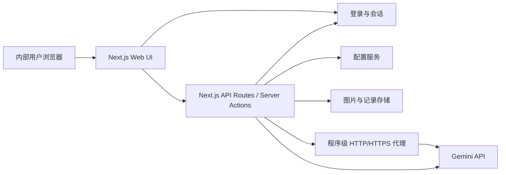

# 技术架构设计

## 总体架构



## 模块划分

### 前端

- `app/page.tsx`：主生图工具页。
- `app/GeneratorClient.tsx`：主生图交互，包括模式切换、上传、提示词、输出参数和发送内容预览。
- `app/login/page.tsx`：登录页。
- `app/register/page.tsx`：自助注册页，注册后等待管理员审核。
- `app/components/Topbar.tsx`：当前用户、部门、导航、退出登录。
- `app/records/page.tsx`：生成记录页，按角色控制可见范围。
- `app/logs/page.tsx`：管理员日志页。
- `app/users/page.tsx`：管理员用户管理页，支持创建、审核、禁用/启用和重置密码。
- `app/settings/page.tsx`：配置中心。

### 后端

- `app/api/auth/login/route.ts`：登录接口。
- `app/api/auth/register/route.ts`：自助注册接口。
- `app/api/auth/logout/route.ts`：退出登录接口。
- `app/api/admin/users/route.ts`：管理员维护用户与审核注册申请。
- `app/api/generate/route.ts`：统一生成接口。
- `app/api/records/route.ts`：生成记录接口，普通用户只返回自己的记录，管理员返回全部记录。
- `app/api/records/[id]/route.ts`：生成记录删除接口，普通用户只能删除自己的记录，管理员可删除任意记录。
- `app/api/logs/route.ts`：管理员查看系统日志接口。
- `app/api/settings/route.ts`：读取和更新配置；敏感字段只返回掩码状态。
- `app/api/settings/test/route.ts`：按部门测试 API Key、代理和模型连通性。
- `lib/auth/session.ts`：会话读取、校验和权限判断。
- `lib/auth/password.ts`：密码哈希与校验。
- `lib/gemini/generate.ts`：通过 REST 调用 Gemini，封装文生图、图生图请求和响应解析。
- `lib/config.ts`：读取环境变量并校验相对路径。
- `lib/storage/files.ts`：保存上传图和生成结果，限制使用相对路径。
- `lib/logging/system-log.ts`：记录登录、注册、审核、设置、生成、删除和错误日志。

## 请求流程

1. 用户打开网站，未登录则跳转 `/login`。
2. 用户登录后，系统通过会话获取 `userId`、`role`、`departmentId`。
3. 浏览器提交提示词、图片、模型和输出参数到 `/api/generate`。
4. 后端校验会话、参数和文件类型。
5. 普通用户使用账号所属部门的 Gemini API Key；管理员如发起生成，需要在请求中明确选择研发一部或研发二部。
6. 后端检查目标部门 API Key 是否存在。
7. 后端根据部门配置创建 Gemini 客户端；若启用代理，使用自定义 fetch agent/dispatcher 让本程序的 Gemini 请求走代理，不修改整台服务器的网络代理。
8. 后端将提示词和上传图片转成 Gemini `contents.parts`。
9. 后端调用 `generateContent`。
10. 后端从响应中提取 `inlineData` 图片，按 `用户ID+年月日时分秒` 命名后保存到相对输出目录。
11. 后端返回图片 URL、模型文本、耗时、记录 ID。

## 配置优先级

配置读取顺序建议如下，越靠前优先级越高：

1. 设置页保存的运行时配置。
2. 环境变量。
3. `.env.example` 中定义的默认值。

敏感字段处理：

- 部门 Gemini API Key 不返回给前端。
- 设置页展示时仅显示掩码，例如 `AIza...abcd`。
- 不同部门保存不同 API Key。
- 若用数据库保存 API Key，应进行服务端加密或至少限制文件权限。

## 数据模型

### `app_settings`

| 字段 | 类型 | 说明 |
| --- | --- | --- |
| `key` | string | 配置键 |
| `value` | text | 配置值，敏感值需加密 |
| `updated_at` | datetime | 更新时间 |

### `departments`

| 字段 | 类型 | 说明 |
| --- | --- | --- |
| `id` | string | 部门标识 |
| `name` | string | 部门展示名 |
| `gemini_api_key_encrypted` | text | 加密后的 Gemini API Key |
| `enabled` | boolean | 是否启用 |
| `created_at` | datetime | 创建时间 |
| `updated_at` | datetime | 更新时间 |

初始部门：

| id | name |
| --- | --- |
| `rd_1` | 研发一部 |
| `rd_2` | 研发二部 |

### `users`

| 字段 | 类型 | 说明 |
| --- | --- | --- |
| `id` | string | 用户 ID |
| `username` | string | 登录账号，唯一 |
| `display_name` | string | 展示名称 |
| `password_hash` | string | 本地账号密码的密码哈希 |
| `role` | string | `admin` 或 `user` |
| `department_id` | string | 普通用户所属部门；管理员可为空 |
| `status` | string | `pending`、`active`、`rejected`、`disabled` |
| `enabled` | boolean | 是否启用 |
| `reviewed_by` | string | 审核管理员 ID |
| `reviewed_at` | datetime | 审核时间 |
| `created_at` | datetime | 创建时间 |
| `updated_at` | datetime | 更新时间 |

管理员账号：

- 账号名固定为 `admin`。
- 密码不在程序中写死；`admin` 的 `password_hash` 由运维在数据库中维护。
- `admin` 用户角色固定为 `admin`。

自助注册：

- 注册字段为 `username`、`password`、`display_name`、`department_id`，全部必填。
- 新注册用户状态为 `pending`。
- 如果用户名对应的用户状态为 `rejected`，允许使用同一用户名重新提交注册，系统将更新注册信息并把状态改回 `pending`。

### `sessions`

| 字段 | 类型 | 说明 |
| --- | --- | --- |
| `id` | string | 会话 ID |
| `user_id` | string | 用户 ID |
| `expires_at` | datetime | 过期时间 |
| `created_at` | datetime | 创建时间 |

### `generation_jobs`

| 字段 | 类型 | 说明 |
| --- | --- | --- |
| `id` | string | 任务 ID |
| `user_id` | string | 发起用户 ID |
| `department_id` | string | 部门标识 |
| `mode` | string | `text-to-image` 或 `image-to-image` |
| `model` | string | Gemini 模型名 |
| `prompt` | text | 提示词 |
| `aspect_ratio` | string | 输出比例 |
| `image_size` | string | 输出分辨率 |
| `output_format` | string | `png` 或 `jpg` |
| `input_images` | json | 上传图片路径和 MIME |
| `output_images` | json | 输出图片路径 |
| `status` | string | `success` 或 `failed` |
| `error_message` | text | 错误摘要 |
| `duration_ms` | integer | 耗时 |
| `created_at` | datetime | 创建时间 |

### `system_logs`

| 字段 | 类型 | 说明 |
| --- | --- | --- |
| `id` | string | 日志 ID |
| `level` | string | `info`、`warn` 或 `error` |
| `action` | string | 动作，例如 `generation.request` |
| `user_id` | string | 操作用户 ID |
| `username` | string | 操作用户名 |
| `department_id` | string | 部门标识 |
| `target_id` | string | 关联目标 ID |
| `message` | text | 日志摘要 |
| `metadata` | json | 请求、响应、错误等结构化信息；不记录 API Key 和图片 base64 |
| `created_at` | datetime | 创建时间 |

## API 草案

### `POST /api/generate`

请求使用 `multipart/form-data`：

- `mode`: `text-to-image` 或 `image-to-image`
- `departmentId`: string，仅管理员发起生成时需要；普通用户以后端会话部门为准
- `prompt`: string
- `model`: string
- `aspectRatio`: string
- `imageSize`: `1K`、`2K`、`4K`
- `outputFormat`: `png` 或 `jpg`
- `images[]`: File，可选

响应：

```json
{
  "id": "job_123",
  "status": "success",
  "images": [
    {
      "url": "/storage/outputs/user_20260512093000.png",
      "mimeType": "image/png"
    }
  ],
  "text": "模型返回的说明文本",
  "durationMs": 18500
}
```

### `GET /api/settings`

管理员接口。返回非敏感配置和掩码后的敏感配置状态。

### `POST /api/settings`

管理员接口。更新配置。后端只接受白名单字段。

### `POST /api/settings/test`

管理员接口。测试指定部门 API Key、代理和默认模型是否可用。

### `GET /api/records`

返回生成记录：

- 管理员：返回全部用户的生成记录。
- 普通用户：只返回当前登录用户自己的生成记录。

### `POST /api/auth/login`

本地账号密码登录接口。请求包含 `username` 和 `password`。只有 `active` 状态用户可以登录。

### `POST /api/auth/register`

自助注册接口。请求字段为 `username`、`password`、`displayName`、`departmentId`，全部必填。注册用户默认状态为 `pending`，审核通过前不能登录。被拒绝的账号允许用同一用户名重新提交注册。

### `POST /api/auth/logout`

退出登录并清理会话。

### `POST /api/admin/users/[id]/approve`

管理员接口。审核通过注册用户，并设置角色和所属部门。

### `POST /api/admin/users/[id]/reject`

管理员接口。拒绝注册用户。

### `DELETE /api/records/[id]`

删除生成记录和生成图片：

- 普通用户：只能删除自己的记录。
- 管理员：可以删除任意记录。
- 删除方式采用物理删除：删除输出图片文件、关联输入缓存文件和数据库记录。

## 并发与限流

建议做全局限流以保护服务稳定性；不做部门级生成次数限制和部门级并发限制：

- 最大并发：2 至 5 个生成任务。
- 单次上传：最多 8 张图，单图默认 10MB。
- 请求超时：120 秒。
- 每日总量：MVP 不限制。

## 安全边界

- 只允许图片 MIME 类型，拒绝脚本、HTML、SVG。
- 上传文件重命名为随机 ID，不信任原始文件名。
- 所有程序配置、存储记录和接口返回路径均使用相对路径。
- 输出文件只暴露相对静态访问路径，不暴露服务器绝对路径。
- 输出文件命名使用 `用户ID+年月日时分秒`，例如 `u123_20260511153045.png`。
- 生成接口、记录接口、设置接口都需要校验登录会话。
- 设置接口只允许管理员访问。
- 记录接口按角色过滤：管理员全部，普通用户仅本人。
- 删除接口按角色校验：管理员可删全部，普通用户仅能删除本人记录。
- 用户密码或登录凭据必须哈希存储，不保存明文。
- 不做上传图片内容审计。
- 配置接口只允许内网访问，并且需要管理员权限。

## 开发约束

- 必须遵循 `../../.openclaw/workspace/archive/规范/2026-04-20-LLM-写代码规范.md`。
- 实现前明确假设和歧义；不确定时先确认。
- 优先简单实现，不做未要求的扩展。
- 修改保持局部化，避免无关重构。
- 每个阶段需要有可验证标准。
- 部署目标为 Docker，运行环境为 Linux OS。
